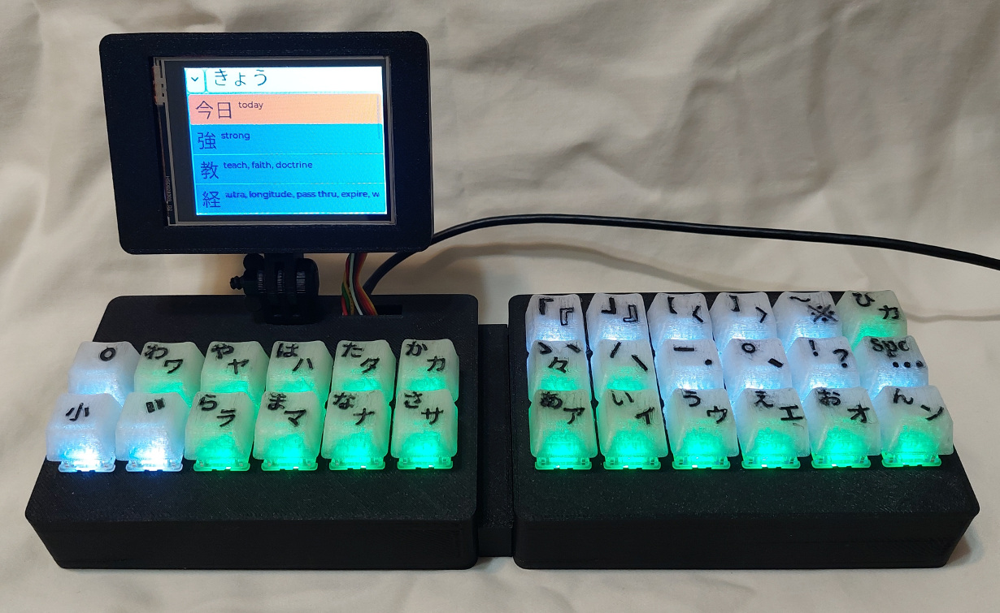
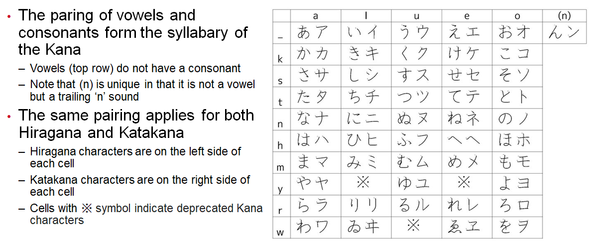
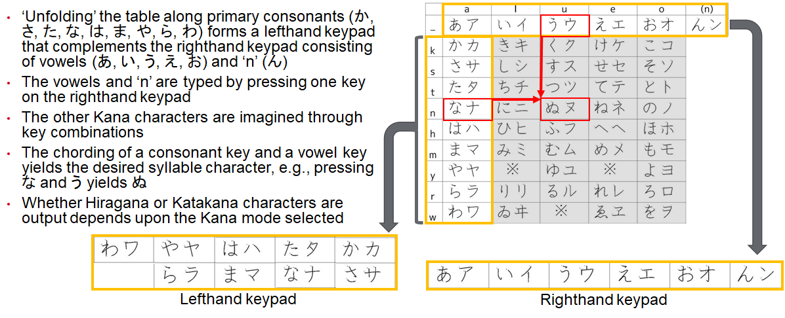
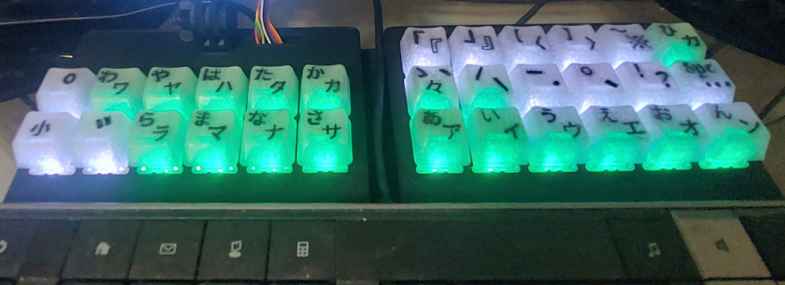
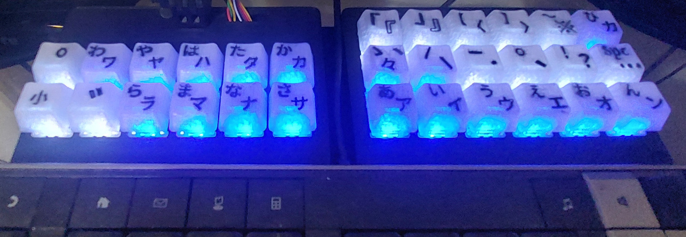
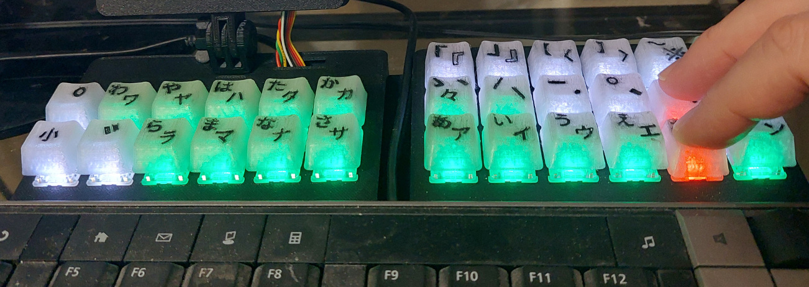
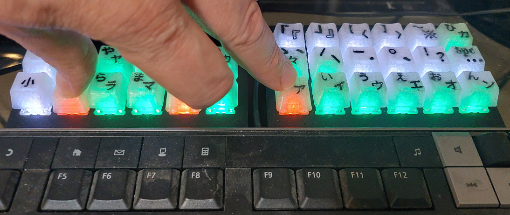

# KanaChord Plus Keyboard 【カナコード・プラス・キーボード】
## Overview 【概要】
KanaChord Plus is an auxiliary keyboard that works in parallel with a standard English keyboard and generates Unicode keyboard macros to render Japanese Kana and Kanji characters.  This allows the user to immediately start typing in Japanese on any supported computer, rather that installing special software and switching language input modes on a single keyboard.  KanaChord Plus can assist the Japanese learner by providing another means to improve their language skills by typing in Japanese, in addition to practicing their reading and speaking skills.  Note that during the composing of this README, KanaChord Plus Keyboard was used to type the Kana and Kanji characters displayed.  KanaChord Plus is a follow-on project of , which supports typing of just Hiragana and Katakana Unicode characters.

### Writing in Japanese 【日本語で書く】
The Japanese writing system consists of three components: Hiragana, Katakana, and Kanji. Hiragana consists of 48 syllabic characters that are used for some words of Japanese origin and grammatical sentence fragments, e.g., あなた, これ, の (‘you’, ‘this’, possessive particle).  Katakana also consists of 48 syllabic characters that are used for foreign loan words and names, e.g., テーブル, クッキー, マック (‘table’, ‘cookie’, ‘Mac’).  The table below shows the syllabary of Hiragana and Katakana, known collectively as the Kana.

### What about Kanji? 【漢字はどうですか？】
Kanji consists of Chinese logography and conveys main ideas and names in sentences.  A Japanese word containing Kanji can consist one or more Kanji characters, e.g., 私, 東京, 日曜日 (I, Tokyo, Sunday), and Hiragana e.g. 買い物、ご飯、寒い (shopping, meal, cold).  There are currently about fify-thousand Kanji characters and new ones are added on occassion.  In Japan, it is expected that a graduating high-school student, starting from elementary school, learn the Jōyō Kanji【常用漢字】, which contains 2136 Kanji characters that are reqularly used or are found in government documents.  A college graduate, especially with an advanced degree, would be expected to learn a thousand or more additional Kanji usually associated with their major.

### Inspiration for a Keyboard 【キーボードの動機】
Over the last century, there have been a number of mechanical and electro-mechanical keyboards have been developed to type Kana and Kanji characters.  A quick web search for 'japanese keyboard' will provide a number of interesting links to follow.  These keyboards all shared common problems.  They were very expensive and slow at typing compared to contemporary English typewriters.  Only a relatively small subset of Kanji (a few thousand) were suported with these typewriers.

The availability of inexpensive computers in recent decades have obsoleted these typewriters, They have replaced purely hardware solutions with ubiquitious keyboards augmented with software running on the computer.  [There are two methods for typing in Japanese](https://www.coscom.co.jp/learnjapanese801/howjpdo.html).  The first is Romaji Input (ローマ字入力, romaji nyūryoku), which uses combinations of Roman characters to represent Japanese syllables. The second is Kana Input (仮名入力, kana nyūryoku), which uses Japanese Kana characters directly.  The more commonly used method is Romaji Input due to the fewer number of characters on the keyboard to remember.  *Comment: I find it a little sad that a foreign character set has taken precedence over the Japanese native characer set for typing in Japanese!*  Software on the computer implements an Input Method Editor (IME) that takes Romaji Input or Kana Input and predicts one or more Japanese words that may contain Kanji. Junferno's video [The Challenge of Making a Keyboard for Every Language](https://www.youtube.com/watch?v=MBQvN03i4-4) provides a nice overview of the difficulties of creating a keyboard that supports non-English characters and the succession of typewriters by computers with keyboards and IMEs. 

The layout of the Kana table inspires a chording keyboard input method. Chording is where multiple keys are pressed simultaneously on the keyboard to obtain a desired character output.  A [Stenotype](https://en.wikipedia.org/wiki/Stenotype) keyboard is an example of a chording keyboard that is used by court recorders and stenographers.  The illustration below provides further explanation and demonstration of how chording is used on the KanaChordPlus Keyboard.

A chording keyboard concept is sufficient for generating all of the Kana.  It is impractical for Kanji, though, as even a chording keyboard would quickly become impractical when attempting to support more than a few dozen Kanji.  Instead, KanaChord Plus incorporates an 'incremental' IME.  As the Hiragana or Katakana are typed, they are presented on a touch screen along with a list of representative Kanji characters and/or Japanese words containing Kanji.  The list is updated with each new Kana character typed, incrementally.  This is not a word-predictive IME, as the Kanji and Japanese words presented are only those corresponding to the Kana currently typed.  The user can either send the Kana characters typed to the computer or select one of the Kanji characters or Japanese words to replace the Kana characters and send that to the computer instead.

## Features 【特徴】
### Dynamic Key Coloring 【動的なキーの色付け】
KanaChordPlus includes dynamic key coloring that provides indication of character type, Kana mode, and error feedback.  The three Shift keys on the left keypad are normally white:
- Voicing mark, a.k.a. dakuten or ten-ten (ﾞ),
- Plosive mark, a.k.a. handakuten or maru (ﾟ),
- Small characters, a.k.a. chiisai (小), also used to ‘shift’ to alternate punctuation and special characters.

Punctuation keys on the top two rows of the right keypad are also normally white:
- Vertical iteration mark (〳,〴,〵), continuation mark (ー), and separation (・) characters ,
- Sentence pausing (、) and ending characters (。, ! , ?),
- Wide space (labeled **Spc**) and ellipsis (…) characters,
- Commonly-used quotation (「, 」,『, 』), bracket (【, 】,〈, 〉), and special (〜,※) characters.

The Kana and horizontal iteration mark keys (ゝ,ゞ,ヽ,ヾ、々) are green for Hiragana mode or blue for Katakana mode.  The mode is selected by the mode key (ひカ) at upper right-hand corner of the right keypad.

### Error Feeback 【エラーフィードバック】
Feedback is provided to the user for incorrect key combinations by changing those keys red.  Releasing the keys will cause the keys to revert to their original colors.  Some examples are provded below:

Keyboard error lighting with press of ! and お key combination.

Keyboard error lighting with press of ﾞ, な, and あ key combination.

### 'Incremental' Input Method Editor 【「インクリメンタル」インプットメソッドエディター】
As mentioned previously, Kanji characters and Japanese words containing Kanji are typed via an 'incremental' Input Method Editor (IME).  Over 6,100 of the most common Kanji charaters and over 6,200 of the most common Japanese words containing Kanji are available in KanaChord Plus.  

As Kana characters are typed, they are presented at the top of the KanaChord Plus display in an single-line Editor Window.  The Editor Window can hold up to nine characters, either Kana or Kanji.  If only Kana characters have been typed, they can be sent to the computer by pressing any punctuation or special character mentioned previously.  The Kana characters will be displayed on the computer followed by the punctuation or special character pressed, with the exception of the wide space character.  Japanese writing does not normally have spaces between words, so it would be unusual to include the wide space character in the output.  To purposely display a wide space character, make sure the Editor Window is empty of characters first before pressing the wide space (**Spc**) key.

Below the Editor Window, a Kanji List Window is presented, its content consisting of Japanese words with Kanji and Kanji characters.  The content of the Kanji List is updated as new Kana character are entered, i.e., incrementally.  The list is displayed with Japanese words presented first, followed by Kanji characters ordered according to the most commonly used first.  The color of each entry indicates whether it is a word or particular Kanji reading:  
- Orange - Japanese word containing Kanji
- Green - The kunyomi or Japanese reading for the Kanji
- Blue - The onyomi or Chinese reading for the Kanji
- Brown -The nanori or name reading for the Kanji

Each entry in the Kanji List has two parts.  On the left side, the kanji character or word (one or more Kanji, sometimes with Kana) is presented.  On the right side, a definition in English is presented.  Definitions are provided to aid the user in making the appropriate selection.  Note that each entry on the list is pronounced according to the Kana present in the Editor Window, i.e., they are homophones, sounding the same.  

The procedure for selecting a Japanese word or Kanji character is illustrated in the animated GIFs below.  Note that the left portion of a Kanji List entry must be pressed to select the Kanji or Japanese word.  Pressing the definition portion of an entry will not cause a selection.  
 Typing 今 (now)           | Close-up (Refresh webpage if out of sync)
:-------------------------:|:-------------------------:
|

 Typing こにちは！コーディです。 (Hello! I am Cody)| Close-up (Refresh webpage if out of sync)
:-------------------------:|:-------------------------:
|

 Typing 今何時ですか？(What time is it now?) | Close-up (Refresh webpage if out of sync)
:-------------------------:|:-------------------------:
|

Once a Kanji or Japanese word has been selected, it can be sent to the computer by typing any Kana, punctuation, or special character.  If a Kana character is a typed, it is displayed in the Editor window, the previous content being sent to the computer.  This allows the user to build up the next set of Kana characters to form a new word or Kanji.  If a punctuation or special character is typed, it gets sent along with the current contents of the Editor Window.  The behavior of the wide space character is the same as mentioned previously, 

The length of the Kana List generated can exceed that of the vertical extent of the display.  The list can be scrolled by dragging on it with a finger, up or down, along the right portion of the list.  Up to ten entries of the current list are displayed at any time.  If more than ten entries are in the list, special navigation entries are provided at the beginning and end of the list, as necessary. When an entry with a down arrow is shown at the bottom of the list, pressing it will cause display of the next set of less common Kanji (move further down the list).  When an entry with an up arrow is shown at the top of the list, pressing it will cause the display of the next set of more common Kanji (move back up the list).  

Some Kanji characters with kunyomi readings have associated okurigana, or following Kana characters.  If the Kanji character selected from the Kanji List has a kunyomi reading (green) and has okurigana, an Okurigana Window appears.  The button in the upper left hand corner of the window contains the Kanji character by itself.  Pressing this button will dismiss the window and cause just that Kanji character to replace the Kana in the Editor Window.  A Cancel buttion is in the upper right hand corner of the window.  Pressing the Cancel button dismisses the window without making any change to the Editor Window.  Below these buttons is a list of Kanji with the associated okurigana on the left and one of three informative remarks in English:  
- Simple reading - The Kanji and Kana characters form a standalone word
- Prefix reading - The Kanji and Kana characters come before other Kanji to form a word
- Suffix reading - The Kanji and Kana characters come after other Kanji to form a word

Scrolling and selection of Kanji within the Okurigana Window follows the same methods as explained for the Kanji List.  No navigation entries are provided because the list of Okurigana is always short.

 Typing 見える (appear) | Close-up (Refresh webpage if out of sync)
:-------------------------:|:-------------------------:
|

### Support Menu 【サポートメニュー】
Pressing on the inverted caret at the upper left-hand corner of the display will a show a dropdown menu listing several support functions.  The first two entries support making changes to the Editor Window.  The last two entries support configuration of KanaChord Plus.
- **Delete last character** - Deletes the last character present in the editor window.  The word and Kanji list is regenerated according to the characters now present in the editor window.  Note that the content of the Kanji List may not be valid if there are Kanji characters in the editor window.
- **Clear input and Kanji list** - Deletes the content of the editor window and clears the Kanji List.
- **Select Macro output mode...** - Opens a window for Unicode key sequence selection.  Press the button labeled with a **checkmark** to save the selected mode to flash memory.  Press the button labeled with an **x** to close the window, abandoning any changes.  KanaChord Plus can output different Unicode key sequences to support different operating systems and applications.  There are currently three settings available:
  - Four-character hexidecimal Unicode value, followed by Alt-X: Supports Microsoft Word and Wordpad, and LibreOffice Writer.
  - Ctrl-Shift-u, followed by four-character hexidecimal Unicode value: Supports Linux applications like LibreOffice Writer and Firefox.
  - Option key, followed by four-character hexidecimal Unicode value: Supports MacOS applications (not yet tested).
- **Calibrate Screen...** - Opens a window to prompt the user to initiate touch screen calibration.  To function properly, the touch screen of the KanaChord Plus display needs to be calibrated.  When the window opens, the user has the option of starting a calibration or closing the window without performing a calibration.  Follow the instructions displayed in the window to perform the calibration.  Once the calibration steps are completed, the calibration values are automatically saved to flash memory.  The user can then close the window or repeat calibration, if desired.  Note that the first time KanaChord Plus is used after programming the Raspberry Pi Pico, the calibration screen will be automatically displayed to require the user to calibrate the touch screen.

## Implementation Overview 【実装の概要】
The primary electical componets of the KanaChord Keyboard are a Raspberry Pi Pico (RP2040) microcontroller, an Adfruit NeoKey 5x6 Ortho Snap-Apart keyboard PCB, a 2.8 inch, 320x240 TFT touch screen display using an IFI9341 controller, and thirty Cherry MX mechanical key switches.  The keycaps and keyboard enclosure are 3D printed designs created with TinkerCAD.  Blank keycaps and an OpenSCAD tight-fit box generator were found on Thingiverse.  No special hardware, such as screws are needed to mount the electrical components and assemble the enclosure.  Details on the electronics, enclosure, and their assembly can be found in the [README.md](./hardware/README.md) in the hardware subdirectory.

KanachordPlus' software was developed with the Arduino IDE (version 1.8.19), Earle Philhower's RP2040 board support package, and LVGL (Light Versatile Graphics Library) version 8.4.  The USB Keyboard library, Adafruit Neopixel library, and Mark Stanley's Key and Keypad libraries provided critical software functions.  Details on the software can be found in the [README.md](./software/README.md) in the software subdirectory.

## Hardware and Software Licenses 【ハードウェアとソフイウェアのライセンス】

KanaChordPlus' circuit design and the STL files for the keycaps, component mounting parts, and enclosure parts are placed under Creative Commons Attribution-NonCommercial-NoDerivatives license.

KanaChord Plus' source code that I wrote (KanaChordChordPlus.ino, dictionary.h, display.cpp, display.h, kana.h, kanji_md.h, kanji_ms.h, kbd_mgt.cpp, kbd_mgt.h, kdict.cpp, kdict.h, kunyomi.h, loop1.h, nanori.h, onyomi.h, settings.cpp, and settings.h) are placed under GNU General Public License, Version 3.0.

The slightly-modified versions of Mark Stanley's Key and Keypad libraries (Key2040.cpp, Key2040.h, Keypad2040.cpp, and Keypad2040.h) fall under the license of the original sources.

## Feedback is Welcome! 【フィードバックは大歓迎です！】
My goal is to provide an axuilary keyboard that is useful to those who want to start writing in Japanese on a computer, while learning Japanese.  I hope to have provided operational features, keycaps, and Asian special characters that would most likely be used.  If you have recommendations for additional features, alternate keycaps, or Asian special characters, please let me know.  I will accomodate as many recommendations as feasible.

## The Future of KanaChord Plus Keyboard 【カナコード・プラス・キーボードの今後】
The recent (August 2024) announcement of the Raspberry Pi Pico 2 provides a direct upgrade path for several features in KanaChord Plus:
- Since the Pico 2 is a drop-in replacement for the Pico 1, there will be no changes in the electronics hardware, unless new capabilities are added that require it.
- The higher performance of the RP2340 microcontroller will make the KanaChord Plus software run faster and be more responsive.
- The increase in size of the flash rom from 2 MB to 4 MB will enable a significant increase in the number of Kanji and/or Japanese words supported.

There will be a delay in updating KanaChord Plus to use the Pico 2, as it will take some time for component availabiltiy and updates to software libraries.  This Github site will be updated when support for the Pico 2 is realized.
