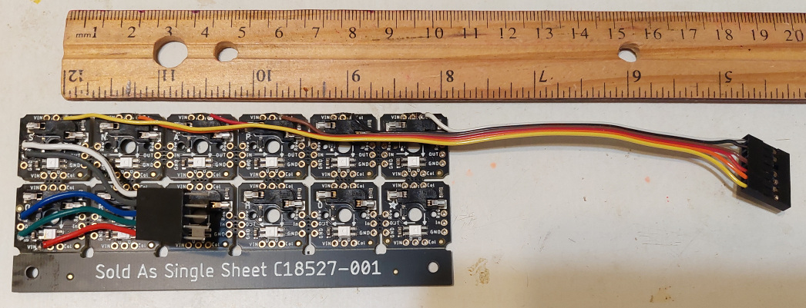
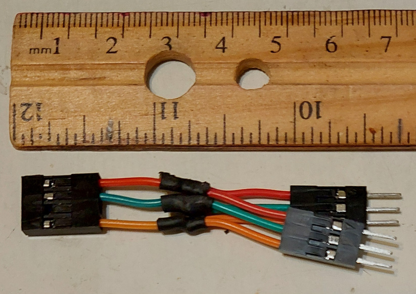
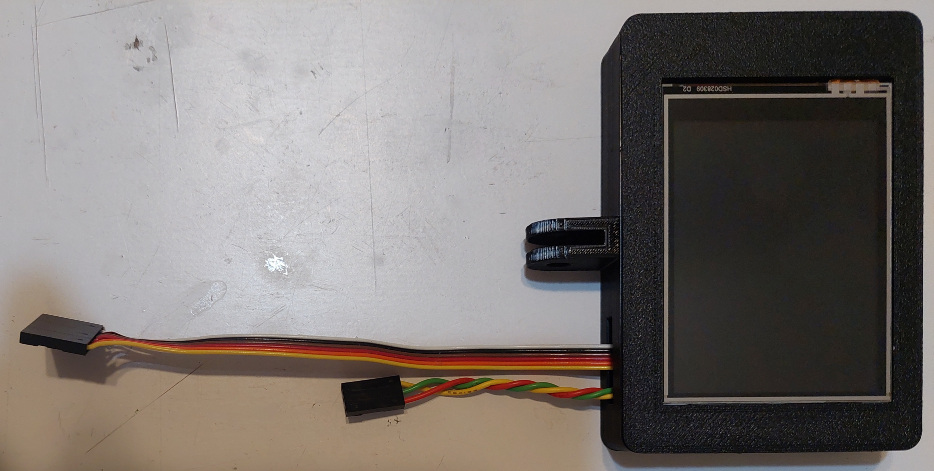

# KanaChord Plus Hardware

## Electronics Components
KanaChord Keyboard uses following electronics parts:
- 1 x Raspberry Pi Pico microcontroller
- 1 x [Adfruit](https://www.adafruit.com) [NeoKey 5x6 Ortho Snap-Apart Mechanical Key Switches w/ NeoPixel - For MX Compatible Switches](https://www.adafruit.com/product/5157)
- 30 x Cherry MX RGB frame-mount mechanical key switches, e.g., [Cherry MX Brown Switches](https://www.cherrymx.de/en/cherry-mx/mx-original/mx-brown.html) (does not count spares)
- 1 x 2.8" 240x320 pixel TFT Display using a ILI9341 controller and a resistive touch screen using a XPT2046 controller [front](./images/display_front.jpg), [back](./images/display_back.jpg)
- 1 x BC547 (or equivalent) NPN transistor
- 1 x 2.2 Kohm 1/8 Watt resistor
- 1 x 6.8 Kohm 1/8 Watt resistor
- 31 x 0.1" Spacing Row Right Angle Headers (does not count spairs), e.g., [Schmartboard brand](https://schmartboard.com/qty-10-0-1-spacing-40-single-row-right-angle-headers-920-0076-01/)
- 3 x Seven-position ITT connector shell - (e.g., Adafruit [Large Single Row Housing Pack](https://www.adafruit.com/product/3146))
- 3 x Five-position ITT connector shell - (e.g., Adafruit [Small Single Row Wire Housing Pack](https://www.adafruit.com/product/3145))
- 1 x Four-position ITT connector shell - (e.g., Adafruit [Small Single Row Wire Housing Pack](https://www.adafruit.com/product/3145))
- 4 x Three-position ITT connector shell - (e.g., Adafruit [Small Single Row Wire Housing Pack](https://www.adafruit.com/product/3145))
- 41 x Female crimp contact pins (does not count spares)
- 5 x Male crimp contact pins (does not count spares)
- 1 x 12 inches of Forty-conductor ribbon cable
- 1 x USB A to USB Micro B cable
- Random short lengths of stranded hook-up wire
- Heat-shrink tubing for enclosing the unidirectional level shifter

## Keyboard Schematics
Below is a pictorial schematic of the keypad portion of the KanaChord keyboard.

While the Neopixels of the Ortho Snap-Apart board can opperate at 3.3 Volts, the 3.3-Volt regulator on the Pico cannot supply enough current.  Therefore, the Neopixels are powered by the Pico's 5-Volt VSYS output.  Consequently, a unidirectional level shifter is used to convert the low-voltage Neopixel signal, NP(LV), to a high-voltage Neopixel signal, NP(HV).  The BC547 and resistors are used to implement the unidirectional level shifter circuit.

Below is a pictorial schematic of the Raspberry Pi Pico and display portion of the KanaChord keyboard.

The right-angle header pins are soldered in 'gull-wing' fashion to pins 1 through 20, 21 through 27, and 36 through 39 of the Pico.  

## Electrical Assembly
### Keypad Preparation
Before assembly, the snap-apart keyboard must be broken into two pieces to form two PCBs (Printed Circuit Boards) for the left and right keypad assemblies.  As shown in the pictoral schematic above and the pictures below, cut apart the keyboard so that the bottom two rows form the left keypad and the top three rows form the right keypad.  

Rather than actually bending the PCB to snap it, it is recommended to use a thin saw to cut the bridges between the rows.  DO NOT cut off the blank sections on the top and bottom of the PCB, as the mounting holes will be used to help position the keypads in the keyboard enclosure.

### Left Keypad Wiring
The wiring of the left keypad assembly is shown in the picture below.  Take note the direction and length of the wires that extend from the left-hand keypad PCB.

First, cut a six-conductor section of ribbon cable with a length of approximatly 19 cm (7.5 inches).  This will be the column cable for the left keypad.  Separate out the individual conductors for about 3 cm (one inch), attach six (6) female crimp terminals, and insert the terminals into a seven (7) terminal connector shell.  Note that there will be an unused place between the terminal pins for Columns 1 and 2, which is Ground Pin 3 on the Pico. Then, as shown in the picture, start at the left end of of the keypad PCB and solder a conductor to a column solder pad. Work towards the right end of the keypad, shortening the length of the conductor to match to the column solder pad location, while keeping the ribbon cable parallel to the PCB. Note that during installation, this cable will fold over to attach to Pins 1 through 7 on the Pico.

Next, create the male keypad interconnect harness using five (5) male crimp terminals. This is a short cable, with a length of approximately 3 cm (1.25 inches), it is recommended to use separate wires, rather than a ribbon cable. A five (5) terminal connector shell is used for this harness. Use the pictorial schematic above for wiring directions. This completes the wiring of the left keypad assembly.

### Level Shifter Assembly
Prior to wiring the right keypad assembly, assemble the unidirectional level shifter circuit.  This can be assembled free-form, as it only has three components.  Doing this keeps the resulting assembly small and relatively flat.  

1. With the flat side of the BC547 transistor facing up, bend the leads as shown.
2. Flip the transistor's flat face down.  Solder the 2.2K resistor to the center pin of the transistor.  Solder the 6.8K resistor to the right pin of the transistor.  Cut off the excess leads on these pins.
3. Solder insulated wires to the left pin of the transistor, the opposite end of each resistor, and at the point where the 6.8K resistor is soldered to the right pin of the transistor.  Make sure that each wire has sufficient length for wiring to the keypad.  **It is highly recommended to use wires that have insulation of different colors to keep track of their functions!**
4. Apply heat-shrink insulation to cover up to the bottom of the transistor.  This will prevent any of the component leads from accidentally shorting.  Note that the two leads on the right side of the circut are covered with one length of shrink-wrap insulation.
5. Cover the entire assembly with a length of heat-shrink insulation.  Doing this will 'encapsulate' the assembly and keep the pins of the transistor from bending and eventually breaking.

### Right Keypad Wiring
The wiring of the right keypad assembly is shown in the picture below. Again, take note of the direction and length of the wires that extend from the right-hand keypad PCB.  

First, cut a six-conductor section of ribbon cable with a length of approximatly 26 cm (10.25 inches).  This will be the column cable for the right keypad.  Separate out the individual conductors for about 3cm (1.25 inches), attach six (6) female crimp terminals, and insert the terminals into a seven (7) terminal connector shell.  Note that there will be an unused place between the terminal pins for Columns 9 and 10, which is Ground Pin 13 on the Pico. Then, as shown in the picture, start at the left end of of the keypad PCB and solder a conductor to a column solder pad. Work towards the right end of the keypad, shortening the length of the conductor to match to the column solder pad location, while keeping the ribbon cable parallel to the PCB. Note that during installation, this cable will fold over to attach to Pins 9 through 15 on the Pico.

Next, create the female keypad interconnect harness using five (5) female crimp terminals. This is a short cable, with a length of approximately 3 cm (1.25 inches), it is recommended to use separate wires, rather than a ribbon cable. A five (5) terminal connector shell is used for this harness. Use the pictorial schematic above for wiring directions.

Now, cut a four-conductor section of ribbon cable with a length of approximatly 28 cm (11 inches).  This will be the row cable for the right keypad.  Separate out the individual conductors for about 3 cm (1.25 inches), attach four (4) female crimp terminals, and insert the terminals into a five (5) terminal connector shell.  Note that there will be an unused place between the terminal pins for Rows 0 and 1, which is Ground Pin 18 on the Pico. Note that three of the ribbon cable conductors attach to the Row solder pads on the right keyboard PCB, while one conductor attaches to the signal input of the level shifter circuit. Note that during installation, this cable will fold over to attach to Pins 16 through 20 on the Pico.

The level shifter is wired into the power harness, which is approximately 10 cm (3.5 inches) long.  The power harness has three (3) female crimp connectors that are inserted into a three (3) terminal connector shell.  Consult the pictorial schematic above for the wiring of the level shifter circiut, with the output of the level shifter connected to the Neopixel input and the power harness 5V and Ground to the right keyboard PCB. During installation, the power harness connector will attach to the Power Wye described below. This completes the wiring of the right keypad assembly.

### Display Wiring
The wiring for the display is shown in the picture below.

Prior to attaching the wiring harness to the display pins, it is necessary to connect the respective SDI CLK, MOSI, and MISO pins of the display and touch screen interfaces, The board RESET and LED pins are also connected together.  This can be accomplished with any small gauge wire.  Kynar-insulated wire-wrap wire works well for this application.

Cut a six-conductor section of ribbon cable with a length of approximatly 22 cm (8.75 inches).  This will be the SPI inteface cable for the display.  Separate out the individual conductors for about 3 cm (1.25 inches), attach six (6) female crimp terminals, and insert the terminals into a seven (7) terminal connector shell.  Note that there will be an unused place between the SPI clock and chip select, which is Ground Pin 23 on the Pico.

At the other end of the wiring harness, separate out the individual conductors for about 5 cm (2 inches).  Attache the six wires to the SPI's SCK, MISO, MOSI, DC, and CS lines for the display controller and touch screen controller.  Consult the pictorial schematic of the Pico and display wiring for details.

The power harness for the display consists of three wires twisted together.  The length of each wire should be about 16 cm (6.5 inches).  Attach three (3) female crimp terminals, and insert the terminals into a three (3) terminal connector shell.  Connect the other end of each wire to the 5V power, ground, and RESET/LED pins.  The RESET/LED pins are supplied 3.3V to keep the display controller running and the display fully lit.  During installation, the power harness connector will attach to the Power Wye described below. 

### Power Wye
The wiring of the power wye is shown in the picture below.  

The overall length of the wires should be approximately 6 cm (2.25 inches)  Each wire is spliced half way to form two wires.  Each is covered with heat-shrink tubing.  Nine (9) crimp terminals are applded to the ends of the wires.  As shown in the picture, insert the terminals at the 'top' of the wye into two, three (3) terminal connector shells.  Make sure to keep the wiring order consistent between the two connectors.  The terminals at the 'bottom' of the wye are inserted into a four (4) terminal connector shell.  Note that there will be an unused place between the terminal pins for 2 and 4, which is 3V3_EN Pin 37 on the Pico.

## 3D-Printed Keycaps
The keycaps for the KanaChord Keyboard were created in TinkerCAD, as shown in the illustration below.  The STL files for the left-hand and right-hand keycap sets can be viewed with the Github STL viewer by clicking on the STL files listed above.

The blank keycap from makerhack's (Chris Garrett) [Custom Cherry MX Keycaps](https://www.thingiverse.com/thing:4702109) was used as the source keycap.  The design is licensed under the [Creative Commons - Attribution license](https://creativecommons.org/licenses/by/4.0/). The Kana and special charaters are text objects converted to TinkerCAD 'holes' that are combined with blank keycaps to form insets. The keycaps were sliced with Cura using the Standard Quality (0.2mm) setting, with 20% infill using the gyroid infill pattern, and Tree supports were used. The keycaps were printed with untinted PLA to allow light from the Neopixels to shine through. After printing, the insets were filled with black acrylic paint, followed by a coat of flat, clear enamel paint.

## 3D-Printed Enclosure
The enclosure for the KanaChord Keyboard was also created in TinkerCAD, as shown in the illustration below.  The STL files for the individual components of the enclosure can be viewed with the Github STL viewer by clicking on the STL files listed above.

The left and right keycase enclosures were created using 0707070user's OpenSCAD program [Customizable snap-fit electronics project box enclosure](https://www.thingiverse.com/thing:2866563). It is licensed under the [Creative Commons - Attribution license](https://creativecommons.org/licenses/by/4.0/). The enclosure components are flipped so tha the lids now act as baseplates for the keyboard enclosure. The enclosures were edited to create the key switch holes of the integral keyplates, the switch and Pico mounts, and pass-through holes for the keyboard feet, and the USB cable.  

The enclosure was designed in halves to fit on the build plate of a Crealty Ender 3 Pro 3D printer.  All components were sliced with Cura using the Low Quality (0.28mm), with 20% infill using the standard in-fill pattern, and no supports were used.  The case components were prited in black PLA, although any color can be used, if desired.

The screw and wingnut were created using mike_mattala's OpenSCAD program [NUT JOB | Nut, Bolt, Washer and Threaded Rod Factory](https://www.thingiverse.com/thing:193647).  It is licensed under [Creative Commons - Attribution - Non-Commercial license](https://creativecommons.org/licenses/by-nc/4.0/).  Print the screw horizontally, so that the layers are parallel to the long axis of the screw.  This will provide strength to the screw along the axis of tension when the wing nut is tightened.  

## Mechanical Assembly

### Applying PCB Cushions
The keypad PCBs are connected to the key switches via sockets.  To prevent the PCBs from coming loose from the key switches, supports are provided to keep the PCBs in place. Two of these supports are shown in the photo below.

The height of each support is such that there is about a 2mm (0.1 inch) gap from the top of the supports to the underside of the PCBs. To fill in the gap, a small disc of 2mm-thick craft foam is attached to top of each support with double-sided adhesive tape.  One way to make the discs is to apply a strip of double-sided tape to a piece of craft foam.  A single-hole hole punch is used to create the discs with the adhesive tape also cut to the same size as the disc.  Eight (8) discs will be needed for the supports.

### Mounting the Raspberry Pi Pico
The Pico is mounted to the left keyboard base by first inserting the end with the USB connector under the bridge of the processor mount at the edge of the keyboard base. Once this is done, push the opposite end of the Pico down into the depression of the processor mount. Finally, slide the retaining clip into the notches in front of the processor mount until the tab of the retaining clip is securely on top of the end of the Pico.

### Break-in the Key Switch Sockets
Prior to mounting the key switches and keypad PCBs, it is highly recommended to 'break in' the key sockets on the keypads.  This is done by inserting a key switch into each key socket at least once.  The key sockets are a little 'stiff' with the first insertion of a switch.  Doing this will make it a bit easier to mount the key switches into the keypads and reduce the possibility of bending the tabs on the key switches.

### Preparing the Enclosures for the Key Switches
It may be necessary to slightly widen the keyplate holes on the enclosures prior to attaching the key switchs and keypads.  For any give hole, try to insert a key switch without any widening.  If a switch plugs in easily, then no widening is needed.  For those holes needing widening, use a flat-sided jewler's file to slightly widen all sides of the hole.  In practice, it should not take much filing to allow a switch to plug in easily.

### Mounting Key Switches and Keypad PCBs to the Enclosures

First, slide on the keyboard bracket on to the right keyboard enclosure.  Make sure that the bracket is inserted such that the side with the tabs flush to the bracket face is inserted first.  Next, place the three-row keypad PCB into right keyboard enclosure. The female keyboard interconnect connector, the column and row cables, and the power harness should slide through the opening in the keyboard bracket. Use the mounting pins, if present, to align the key sockets with the holes of the integral key plate.

Start at one end of the enclosure and insert a key switch through the hole of the keyplate into the socket of the PCB. Place a finger against the key socket, on the bottom side of the PCB, to support key switch insertion. Having a keycap on the switch will make it easier to press the switch in.  Once the switch is inserted, go to the opposite end and insert another key switch as before.  Doing this will stablize the PCB position for inserting the rest of the key switches.  Working from the ends towards the center of the enclosure, plug in more keys until all eighteen switched are plugged in.

Now insert the left keypad PCB into the left keyboard enclosure.  As with the right keypad, align the key socket with the holes in the integral keyplate.  Insert the key switches, again working from both end of the enclosure to the center.  Once all of the key switches are inserted, slide the left keyboard enclosure onto the other side of the keyboard bracket.  While doing this, fold up the male keyboard connector to clear the bracket and then plug it into the female keyboard connector.

After completing these steps the keyboard assembly show look as shown in the picture below.

### Display Assembly
Place the display board into the display front piece.  Make sure to first remove the plastic screen protector sheet that the display board comes shipped with!  The connector of the display board should align with the wider part of the vertcal frame and the screen should be flush to the forward surface of the display front piece.  

Next, position the display front piece and the display body such the the bottom of both parts are adjacent to each other.  Fold the ribbon cable and power harness to the right so that they pass over the slot on the bottom the display body.  This should appear as shown in the picture below.  

Finally, flip the display front piece and display board over and thread the ribbon cable and power harness through the slot on the bottom of the display body.  Set the front piece on the display body and carefully press it until it snaps in place. DO NOT press on the display screen, as doing so could crack the display or touch screen, ruining it.  Once this is done, the display assembly should appear as in the picture below and is ready for final assembly.  Set it aside to start connecting cables to the Pico.

### Inserting Connectors onto the Pico
Insert the female connector (four-pin shell) of the power wye cable on to pins 36 through 39 on the Pico.  Make sure that the 3.3V wire (orange) is connected to 3V3(OUT) (pin 36), the ground wire (green) is connected to GND (pin 38), and the 5V wire (red) is connected to VSYS (pin 39). Then, connect the column cable for the left keypad to pin 1 through pin 7 on the Pico.  The Column 0 (C0) wire should be connected to pin 1.  The picture below shows how the connections should look.

Take the arm of the power wye that is below the other arm and bend it such that it can plug into the power harness of the right keypad assembly.  Make sure that 3.3V conductor (orange), Ground conductor (green), and 5V conductor (red) are matched up.  Otherwise a short or an over-voltage could be applied to a sensitive circuit.  The picture below shows how the connections should look.

Next, insert the column cable for the right keypad to pin 9 through pin 15 on the Pico. The Column 6 (C6) wire should be connected to pin 9.  Then, connect the row cable for the right keypad to pin 16 through pin 20 on the Pico. The Row 2 (R2) wire should be connected to pin 16 and the Neopixel low voltage (NP(LV)) wire should be connected to pin 20. The picture below shows how the connections should look.  

Attach the display bracket to the display assembly by threading the fingers of the bottom of the display assembly between the fingers of the bracket.  Make sure that the bracket is aligned such that the hexagonal hole is on the right side of the display assembly.  Insert the display assembly's ribbon cable and power harness through the slot in the top of the left keypad assembly.  The picture belows shows how this should look.

Raise up the keyboard and insert the base of the display bracket into the dado slot on the left keypad.  Slide the bracket in until the back of the bracket flush with the back of the left keypad.  The picture belows shows how this should look.

Plug the connector of the display assembly's ribbon cable into pins 14 through 20 of the Pico.  Note that pin 18 will not have a connector pin.  Now plug the power harness of the display assembly into the remaining arm of the power wye.  Make sure that 3.3V conductor (orange/yellow), Ground conductor (green), and 5V conductor (red) are matched up.  Otherwise a short or an over-voltage could be applied to a sensitive circuit.  The picture below shows how the connections should look.

### Attach Keyboard Bases and Feet
Now that the wiring is completed, the keyboard enclosure can be closed.  Place the right keyboard base onto the bottom of the right keyboard enclosure.  Make sure that the wiring and level shifter do not interfere with the keypad PCB supports pushing up against the bottom of the right keypad.  The keyboard base is a press-fit design, so it should pop into place without too much effort.  Now, fold over the left keyboard base, making sure that the wiring does not interfere with the keypad PCB support pushing up against the bottom of the left keypad.  Snap the left keyboard base into place, as was done with the right keyboard base. The assembly should appear as shown in the picture below.

Attach the three keyboard feet by sliding the attachment pegs into the holes and sliding the feet into the slots.  If desired, the right and left keyboard feet can be glued into place.  It is not recommended to glue the center foot, as doing so would make it difficult to disassemble the keyboard for maintenance or modification.

This concludes the hardware construction of the KanaChord Keyboard.  If not already done, program the Pico with the KanaChord software and put the keyboard to use!

