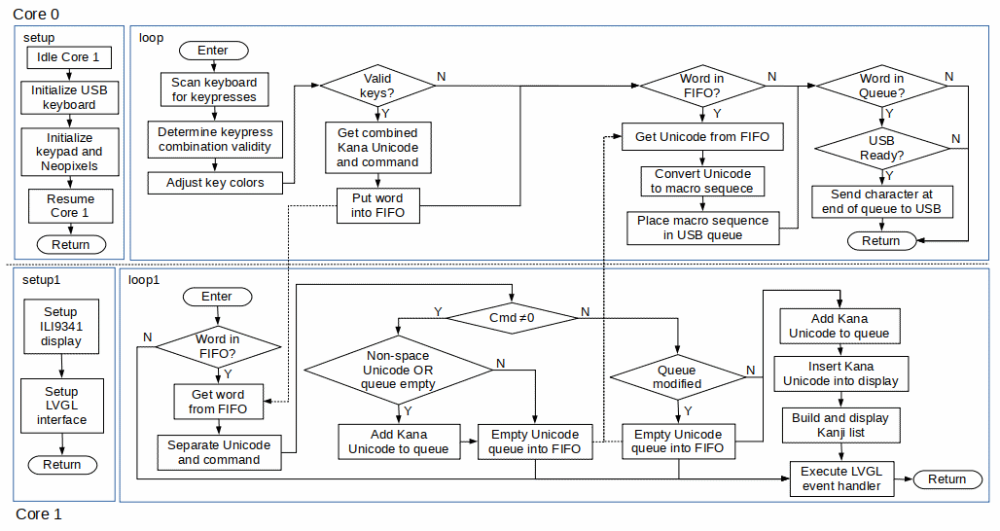
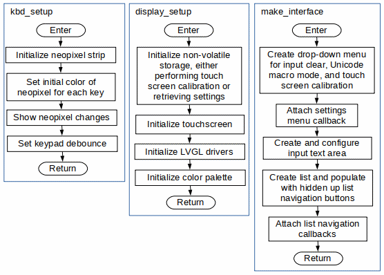

# KanaChord Plus Software
The software for KanaChord Plus was developed with open-source tools and libraries:
- Arduino Integrated Development Environment (Version 1.8.19),
- Wiring programming language (C++-ish),
- [Earle Philhower's RP2040 Arduino board support package](https://github.com/earlephilhower/arduino-pico),
- Libraries used:
   - [Arduino USB Keyboard Emulation](https://www.arduino.cc/reference/en/language/functions/usb/keyboard/),
   - [Mark Stanley's Arduino Keypad](https://github.com/Chris--A/Keypad),
   - [Adafruit Neopixel](https://github.com/adafruit/Adafruit_NeoPixel),
   - [Light and Versatile Graphics Library](https://lvgl.io/), version 8.4.

Note that the source code for the Keypad library has been slightly modified for the RP2040 and the file names have been renamed accordingly.  The output drive current for the keyboard polling lines has been set to 12 milliamps, which is the maximum for the RP2040.  It was found that the default setting of 4 milliamps provided insufficient current for the keyboard.

## Unicode Data
The file kana.h contains C++ arrays of 16-bit Unicode values for Kana (Hiragana and Katakana) characters, and some Chinese/Japanese/Korean punctuation and special characters.  The file kanji_md.h contains C++ structures of 16-bit Unicode values for Kanji characters.  Details on these Unicode blocks can be found in the following PDFs:
- [Official Unicode Consortium Hiragana code chart](https://www.unicode.org/charts/PDF/U3040.pdf)
- [Official Unicode Consortium Katakana code chart](https://www.unicode.org/charts/PDF/U30A0.pdf)
- [Official Unicode Consortium CJK Symbols and Special characters code chart](https://www.unicode.org/charts/PDF/U3000.pdf)
- [Official Unicode Consortium General Punctuation characters code chart](https://www.unicode.org/charts/PDF/U2000.pdf)
- [Official Unicode Consortium CJK Unified Ideographs code chart](https://www.unicode.org/charts/PDF/U4E00.pdf)

The arrays containing the Kana are grouped according Hiragana and Katakana character sets. Individual arrays represent unaugmented (base) characters and augmented characters, i.e., ten-ten, maru, and small (chiisai) characters. Each array is organized by ten 'consonants' (rows) and six 'vowels' (columns).  Special characters are also grouped according to Hiragana and Katakana character sets, although this results in most characters being duplicates in these sets. This was done to simplify the code used to access the arrays.  

The function getKanaUnicode(), defined in kbd_mgt.cpp, takes inputs of Kana mode, special character mode, shift mode, and index row and column to select a Unicode character value. If the selected Unicode value is 0x0000, then an illegal key combination has been selected.

## Compiling and Uploading the KanaChord Keyboard Software
First, start the Arduino IDE and click on Tools on the menubar and select Manage Libraries from the drop-down menu.  Install Earle Philhower's RP2040 Arduino board support package and the Arduino USB Keyboard emulation library.  Next, select Tools on the menubar and select Board from the drop-down menu.  Select 'Raspberry Pi RP2040 Boards' from the displayed cascade menu, and then 'Raspberry Pi Pico' from the next displayed cascade menu.

Now that Pico board support is in place, adjust the board parameters as shown in the picture below:  

Place the KanaChord Plus source files into a new directory named KanaChordPlus. Load KanaChordPlus.ino with the Arduino IDE. Click the Verify button to ensure that the KanaChord source code compiles successfully.  Compiling will take some time because of the size of the dictionary header files.  The compile status should be as shown in the picture below.  If compiling fails, check that all needed files and libraries are installed and the configuration is correct.

Now, connect the Raspberry Pi Pico to the computer with a USB cable.  Click the Upload button to compile the KanaChord source code and upload the compiled binary to the Pico.  If the upload fails, make sure that the USB cable is securely connected to the Pico and the computer performing the programming. It may also be necessary to hold down the BOOTSEL button on the Pico while plugging the USB cable into the computer.

## Details on the KanaChord Plus software
The software in KanaChord Plus is much more complicated compared to that in the original [KanaChord Keyboard](https://github.com/maccody/KanaChord).  KanaChord only has to support the typing of Unicode for the Kana and a few special characters.  This is accomplished via a keyboard polling loop, a look-up table to match valid key combinations to Unicode, and sending the Unicode macro key sequence through a USB keyboard emulation to the host computer.  KanaChord Plus adds support for Kanji Unicode output, which is not trivial and requires some compromises.  The [dictionaries of Kanji and Japanese words](./dictionaries/README.md), the incremental IME (Input Method Editor), and the touch screen display, with [custom large font](./lvgl/README.md), all contributed to the added complexities.  

Fortunately, the Raspberry Pi Pico has hardware features that are not fully exploited by the KanaChord Keyboard.  One of two processing cores in the RP2040 processor are unused, as well as over 90% of the 2MB of flash ROM. The availability of two SPI (Serial Peripheral Interface) ports and additional general purpose I/O ports also enable the addition of extra capabilities required by the software in KanaChord Plus.

Having two cores in the RP2040 microcontroller enables hardware parallelism, dividing the processing load so that no single processor is overloaded.   In the Pico, Core 0 of the RP2040 is dedicated to interfacing with the USB interface.  In the KanaChord software, Core 0 was also used to poll the keypads.  It made sense to keep these functions together in KanaChord Plus.  Core 1 is dedicated to running the incremental IME, the display, and the touch screen, as their functions are tied closely together.

The subsections below describe various elements of the KanaChord Plus software.  Note that these descriptions are not detailed and do not cover every function in the code base.  There are some helper functions that are only inferred.  Also, the flowcharts may lack some details.  The best way to fully understand the code is to study the source code itself.

### Arduino setup() and loop() functions
High-level flowcharts for the Arduino setup() and loop() functions for Core 0 and setup1() and loop1() functions Core 1 are presented below:   

Core 0 setup() processing initializes keypad polling, Neopixel configuration, and USB keyboard emulation.  Core 0 loop() processing manages keypad inputs, Neopixel states, and Unicode macro sequences outputs through the USB keyboard emulation.  A lot of the keypad processing performed by Core 0 involves determining whether a pressed key combination is valid or not.  If the combination is invalid, the Neopixels of the pressed key combination are turned red.  When the invalid key combination is released, the key colors are restored to their proper states.  If the combination is valid, a 16-bit Unicode, paired with a command flag, is sent to Core 1 via the Core 0-to-Core 1 FIFO.

Unicode characters are received from Core 1 via the Core 1-to-Core 0 FIFO. The Unicode characters are convered to Unicode macro sequences and placed into an output queue for output through the USB keyboard emulation.  The macro sequence sent is determined by a mode variable that is user-configurable and stored in non-volatile storage.  The macro sequences currently supported are for Microsoft Windows applications (e.g., MS Word, Wordpad, LibreOffice), Linux applications (e.g., LibreOffice, Firefox), and MacOS applications (functionality not tested yet).  The transmission rate of the macro code sequences are controlled to avoid sending garbled sequences to the host computer.

Core 1 setup() processing initializes the ILI9341 TFT display controller, the XPT2046 touch screen controller, the LVGL library, and the LVGL main interface.  Core 1 loop() processing manages the incremental IME, the LVGL display, and touch screen functions that allow the user to select Kanji and Japanese words based upon the Kana characters typed.  The simplicity of the loop belies the functionality performed by Core 1.  There are several complex functions performed by the incremental IME and the LVGL event handler executes callback functions that are described in subsequent sections.

Core 1 receives 16-bit Unicode and acommand flag via the the Core 0-to-Core 1 FIFO.  These are separated and the command flag determines how the Unicode code is inserted into the editor queue.  A command flag value of zero indicates that the Unicode is a Kana character.  This causes the Kana Unicode to be appended to the editor queue, unless the queue has been modified through selection of a Kanji or Japanese word.  In that case, the editor queue is first flushed of its contents, sent to Core 0 via the Core 1-to-Core 0 FIFO, and the new Kana Unicode is then placed into the emptied editor queue.  If there are Kana characters in the editor queue, the incremental IME functions are called to search the dictionaries for Kanji and Japanese words that correspond to the Kana characters.  The results are displayed for the user to select what is needed.

If the command flag associated with a received Unicode is a value of one, that the Unicode is a special character.  The character's treatment depends upon the special character.  If the special character is not a wide space, the Unicode is appended to the editor queue and the editor queue is flushed to Core 0.  If the character is a wide space, it is not appended to the editor queue and the editor queue is flushed to Core 0.  Normally, wide space characters do not appear within Japanese sentences.  If the editor queue is already empty, the wide space Unicode is placed in the editor queue and the queue is then flushed to Core 0.  This conditional behavior allows typing the wide space to force a Unicode sequence to be sent without adding a trailing special character, but still allows for the explicit output of wide space characters when needed.

### Functions for setting up the hardware
Flowcharts of the functions used to set up hardware are shown below.  The function kbd_setup() is called by setup(), while display_setup() and make_interface() are called by setup1().  

Keypad initialization is performed primarily by the creation of an instance of the keypad class, found within kbd_mgt.cpp.  The remaining tasks performed by kbd_setup() are the initialization of the Neopixels in the Neokey kepads and changing the keypad debounce period from the default of 20 milliseconds to 40 millisecond.  When KanaChord Plus is first powered, it is set up for Hiragana input mode, so the Kana keys are set to green.  The shift keys and special characters keys are set to white.

The display_setup() function initializes non-volitale storage, if necessary.  This causes the touch screen calibration function to be called, which requires user input to accomplish.  If the non-volatile storage has already been initialized, then the existing touch screen calibration data is read.  This information is used to initialize the touch screen interface.  The LVGL software also require an initialization call prior to use.  In additional, the color palette for the KanaChord Plus interfaces are defined.

Once the LVGL software is initialized, make_interface() is called to create the main user interface using LVGL function calls.  This interface consists of a dropdown menu for character editor commands and user-selectable settings, the character editor window and the Kanji list window.  Currently, the menu provides two editor commands, which are: 1) delete the last character entered, and 2) delete all characters in the editor buffer.  The user-selectable settings are: 1) select the Unicode keyboard macro mode, and 2) perform the touch screen calibration.  A callback function for the dropdown menu is then initialized.  The text Editor window and the Kanji List window are then created.  Within the Kanji list window are two navigation buttons that are initially hidden, but are displayed when needed.  The callback functions for these buttons are then initialized.

### Functions for configuration settings
Five functions are used to manage the dropdown menu entries described in the previous section.  Three of the functions are callbacks that are invoked while interacting with the dropdown menu and supporting windows.  Two of the functions create the supporting windows.  The flowcharts for these functions are presented below.  

The callback function settings_event_cb() is invoked when one of the entries on the settings dropdown menu are selected.  If the first menu entry is selected, the last character in the Editor window and Unicode queue are deleted.  Then, the content of the Kanji list window is cleared and a new Kanji List is generated using the remaining Kana characters in the Unicode queue as the key to search the dictionaries.  If the second menu entry is selected, all characters in the Editor window and Unicode queue are deleted.  The Kanji list window and the Kanji List are cleared, as there is no key available for a dictionary search.  

If the third menu entry is selected, a window is displayed using the function create_macro_select_window().  This new window allows the user to select the Unicode macro sequence that will be sent from KanaChord Plus to the host computer.  Once the sequence is selected, the user can Save the setting to non-volatile memory, invoking the save_macro_cb() function, or Cancel the change.  In either case, the window is dismissed using a callback function.  Note that callback functions, not described here, are created for the macro mode selection buttons.  

If the fourth menu entry is selected, a window is displayed by calling the function create_touch_calibration_window().  This window provides instructions to the user for performing a touch screen calibration.  When pressed, the Start Calibration button invokes the calibration_cb() function to run the touch screen calibration code.  Once completed, the new calibration parameters are saved to non-volatile memory.  Using the Cancel button closes the window.

### Functions that manage the Reading dictionaries
KanaChord Plus' incremental IME uses the Kana characters entered by the user as keys to search dictionaries of Kanji and Japanese words.   The results of the searches are displayed in the Kanji List window.  The user can then select which Kanji character or Japanese word will replace the Kana n the Editor window to convey the intended meaning, prior to sending that Unicode to the host computer.  The flowcharts for searching the dictionaries and creating the Kanji list data are presented below.  

When a new Kana character is added to the Kana queue, as displayed in the Editor window, the function build_kanji_list_data() is called.  Four dictionaries are searched, one each for Kunyomi, Onyomi, and Nanori readings, and one for Japanese words.  The corresponding functions calls are getKunyomiReading(), getOnyomiReading(), getNanoriReading(), and getDictionaryReading().  These four functions perform the same operations - generate a Murmur3 32-bit hash key and call the function get_reading(), but reference a different Binary Structured Tree (BST) for each dictionary.  The function get_reading() traverses the referenced BST recursively, searching with the key until either a match is found or a null pointer is encoutered.  If a match is found, the pointer to the matching reading structure is returned, otherwise a NULL pointer is returned.  For additional information on the dictionaries, consult the [KanaChord Plus dictionaries](./dictionaries/README.md) document in the dictionaries subdirectory.

Once are results are obtain from the four search operations, data for the Kanji list is generated.  The Kanji list is a list of pointers to different reading data, ordered according to the frequency (commonality) of the Kanji.  Note that Japanese words always appear first in the list, as they are common words that are likely to be used.  The goals is to present common Japanese words followed by Kanji characters that are ranked with most commonly-used Kanji first.

### Functions to display and manage Kanji lists
After the Kanji list data is generated from the four sets of dictionary data, it is displayed in the Kanji list window.  The user can then scroll through the list and select a Kanji or Japanese word.  The flowcharts for displaying, navigating, and selecting entries in the Kanji list window are presented below.  

The function build_kanji_list() prepares the Kanji List window by first calling the function clear_kanji_list() to remove the current Kanji entries displayed and hide the navigation buttons.  If the Kanaji data list has no content, then further processing is skipped.  If content is present, it is determined how how many elements the list has.  Some Kana readings yield many tens, even hundreds, of elements in the Kanji data list.  Displaying them all at once would make the scrolling interface slow to respond.  Consequently. no more than ten entries (Kanji and/or Japanese words) are presented in the Kanji List window at any one time.  As requied, paging buttons are display at the start and end of the abbreviated list.  The user can page to more and less commonly used Kanji accordingly.  The callback funcions kanji_nav_up_cb() and kanji_nav_dn_cb() are used to refresh the content of the Kanji list window, respectively.

Selection of a displayed Kanji or Japanese word is accomplished via the callback function kanji_list_cb().  Pressing of the button, positioned to the left of each Kanji List entry, is required to actually make a selection.  The right portion of each entry, displaying the English-language meaning of the Kanji or Japanese word, does not support selection, but enables the user to scroll up and down.  If the button pressed is associated with a Kanji's Onyomi or Nanori reading or a Japanese word, the character(s) replace the Kana content of the Editor window and their corresponding Unicodes in the Kana queue.  If the button pressed is associated with a Kanji's Kunyomi reading and there are no Okurigana for the reading, then the behavior is the same as the others.  Otherwise, the Okurigana window is displayed, as described in the next subsection.

### Functions to display and manage Okurigana lists
The Okurigana window is displayed whenever a Kanji is selected that has Okurigana associated with it.  The layout of this window is similar in style and usage as the Kanji list window.  The flowcharts for displaying and selecting entries in the Okurigana are presented below.  

The function build_okurigana-window() first creates an LVGL window widget and populates the top banner with two buttons and a title.  The right button is a Cancel button.  When pressed, the Okurigana window is dismissed without making any changes to the editor window or Kana queue.  The left button is decorated with the Kanji character only.  Pressing this button invokes the callback function kanji_only_cb(), which causes only the Kanji character to replace the Kana charcters in the editor window and the Kana queue, followed by dismissing the Okurigana window.

Below the buttons and title bar, a list of Kanji entries are created.  The left portion of each entry is a button showing the Kanji and its Okurigana.  The right portion of each entry shows the type of reading the Okurigana represents: simple (or standalone), prefix (leading other Kanji), or suffix (trailing other Kanji).  Pressing on an entry invokes the callback function okuri_button_cb(), , which causes the Kanji and Okurigana charactera to replace the Kana charcters in the editor window and the Kana queue, followed by dismissing the Okurigana window.  As with the Kanji list window, the button at the left of the entry must be pressed for the replacement to occur.  The right portion allows the user to scroll the list as needed.
