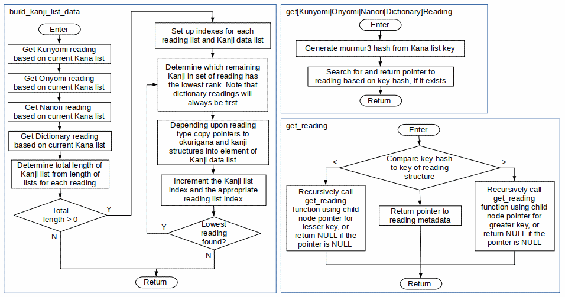

# KanaChord Plus Software
The software for KanaChord Plus was developed with open-source tools and libraries:
- Arduino Integrated Development Environment (Version 1.8.19),
- Wiring programming language (C++-ish),
- [Earle Philhower's RP2040 Arduino board support package](https://github.com/earlephilhower/arduino-pico),
- Libraries used:
   - [Arduino USB Keyboard Emulation](https://www.arduino.cc/reference/en/language/functions/usb/keyboard/),
   - [Mark Stanley's Arduino Keypad](https://github.com/Chris--A/Keypad),
   - [Adafruit Neopixel](https://github.com/adafruit/Adafruit_NeoPixel),
   - [Light and Versatile Graphics Library](https://lvgl.io/), version 8.4.

Note that the source code for the Keypad library has been slightly modified for the RP2040 and the file names have been renamed accordingly.  The output drive current for the keyboard polling lines has been set to 12 milliamps, which is the maximum for the RP2040.  It was found that the default drive current of 4 milliamps provided insufficient current for the keyboard.

## Unicode Data
The file kana.h contains C++ arrays containing the 16-bit Unicode values for Kana (Hiragana and Katakana) characters, and some Chinese/Japanese/Korean punctuation and special characters.  The file kanji_md.h contains C++ structures containing 16-bit Unicode values for Kanji characters.  Details on these Unicode blocks can be found in the following PDFs:
- [Official Unicode Consortium Hiragana code chart](https://www.unicode.org/charts/PDF/U3040.pdf)
- [Official Unicode Consortium Katakana code chart](https://www.unicode.org/charts/PDF/U30A0.pdf)
- [Official Unicode Consortium CJK Symbols and Special characters code chart](https://www.unicode.org/charts/PDF/U3000.pdf)
- [Official Unicode Consortium General Punctuation characters code chart](https://www.unicode.org/charts/PDF/U2000.pdf)
- [Official Unicode Consortium CJK Unified Ideographs code chart](https://www.unicode.org/charts/PDF/U4E00.pdf)

The arrays containing the Kana are grouped according Hiragana and Katakana character sets. Individual arrays represent unaugmented (base) characters and augmented characters, i.e., ten-ten, maru, and small (chiisai) characters. Each array is organized by ten 'consonants' (rows) and six 'vowels' (columns).  Special characters are also grouped according to Hiragana and Katakana character sets, although this results in most characters being duplicates in these sets. This was done to simplify the code used to access the arrays.  

The function getKanaUnicode(), defined in kbd_mgt.cpp, takes inputs of Kana mode, special character mode, shift mode, and index row and column to select a Unicode character value. If the selected Unicode value is 0x0000, then an illegal key has been selected.

## Compiling and Uploading the KanaChord Keyboard Software
First, start the Arduino IDE and click on Tools on the menubar and select Manage Libraries from the drop-down menu.  Install Earle Philhower's RP2040 Arduino board support package and the Arduino USB Keyboard emulation library.  Next, select Tools on the menubar and select Board from the drop-down menu.  Select 'Raspberry Pi RP2040 Boards' from the displayed cascade menu, and then 'Raspberry Pi Pico' from the next displayed cascade menu.

Now that Pico board support is in place, adjust the board parameters as shown in the picture below:  

Place the KanaChord Plus source files into a new directory named KanaChordPlus. Load KanaChordPlus.ino with the Arduino IDE. Click the Verify button to ensure that the KanaChord source code compiles successfully.  Compiling will take some time because of the size of the dictionary header files.  The compile status should be as shown in the picuture below.  If compiling fails, check that all needed files and libraries are installed and the configuration is correct.

Now, connect the Raspberry Pi Pico to the computer with a USB cable.  Click the Upload button to compile the KanaChord source code and upload the compiled binary to the Pico.  If the upload fails, make sure that the USB cable is securely connected to the Pico and the computer performing the programming. It may also be necessary to hold down the BOOTSEL button on the Pico while plugging the USB cable into the computer.

## Details on the KanaChord Plus software
The software in KanaChord Plus is much more complicated compared to that in the original [KanaChord Keyboard](https://github.com/maccody/KanaChord).  KanaChord only has to support the typing of Unicode for the Kana and a few special characters.  This was accomplished via a keyboard polling loop, a look-up table to match valid key combinations to Unicode, and sending them through a USB keyboard emulation to the host computer.  KanaChord Plus adds support for Kanji Unicode output, which is not trivial and required some compromises.  The [dictionaries of Kanji and Japanese words](./dictionaries/README.md), the incremental IME (Input Method Editor), and the touch screen display, with [custom large font](./lvgl/README.md), all contributed to the complexities.  

Fortunately, the Raspberry Pi Pico has hardware features that were not fully exploited by the KanaChord Keyboard.  One of two processing cores in the Pico are unused, as well as over 90% of the 2MB of flash ROM. Two SPI (Serial Peripheral Interface) ports and additional general purpose I/O ports also contribute to enabling the addition of extra capabilities required by the software in KanaChord Plus.

Having two cores in the RP2040 microcontroller enables hardware parallelism, dividing the processing load so that no single processor is overloaded.   In the Pico, Core 0 of the RP2040 is dedicated to interfacing with the USB interface.  In the KanaChord software, Core 0 was also used to poll the keyboard.  It made sense to keep these functions together in KanaChord Plus.  Core 1 is dedicated to running the incremental IME, the display, and the touch screen, as their functoins are tied closely together.

The subsections below describe various elements of the KanaChord Plus software.  Note that these descriptions are not detailed and do not cover every function in the code base.  There are some helper functions that are only inferred.  Also, the flowcharts may lack some details.  The best way to fully understand the code is to study the source code itself.

### Arduino setup() and loop() functions
A high-level flowchart of the Arduino setup() and loop() functions for both Core 0 and Core 1 is presented below:   

The Core 0 set up processing initializes keypad polling, Neopixel configuration, and USB keyboard emulation.  The Core 0 loop processing manages keypad inputs, Neopixel states, and Unicode macro outputs through the USB keyboard emulation.  A lot of the keypad processing performed by Core 0 involves determining whether a pressed key combination is valid or not.  If the combination is invalid, the Neopixels of the pressed key combination are turned red.  When the invalid key combination is released, the key colors are restored to their proper states.  If the combination is valid, a 16-bit Unicode paired with command flags is sent to Core 1 via the Core 0-to-Core 1 FIFO.  

The macro sequence sent is determined by a mode variable that is user-configurable and stored in non-volatile storage.  The macro sequences are for Microsoft Windows applications (e.g., MS Word, Wordpad, LibreOffice), Linux applications (e.g., LibreOffice, Firefox), and MacOS applications (functionality not tested yet). The setting of the Macro Mode Switch can be change at any time, while not pressing keys, to change the Unicode macro sent.  This is useful when switching between applications that use different Unicode macro sequences. For additional details, consult the commented source code.

a Unicode key value is converted to ASCII and sent as part of a macro sequence to the USB device interface for transmission to the computer. 

The processing of the two cores are lightly coupled through the 32-bit FIFOs provided by the RP2040 board support package.  16-bit Kana Unicode characters, combined with command bits, are sent from

### Functions that set up the hardware

### Functions for configuration settings

### Functions to manage the Reading dictionaries

### Functions to display and manage Kanji lists

### Functions to display and manage Okurigana lists

