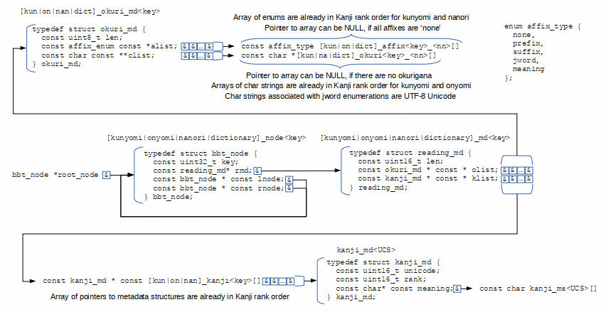

# KanaChord Plus Dictionaries
KanaChord Plus 

## Data Structures forming the Dictionaries

Several approaches were considered to store the dictionaries on the Raspberry Pi Pico:
- External flash card accessed through an SPI interface using a flash card reader library.
- Use part of the Pico's flash ROM as a flash drive using a flash card reader library.
- Create data structure representing the dictionaries that are stored in the flash ROM and accessed directly.

Chose to store the dictionaries as directly-addressable structure stored in the Raspberry Pi Pico's flash memory.
- QSPI interface to external flash memory faster than accessing an external flash card via SPI
- Directly accessed data structures avoid the overhead and speed penalty of a flash card reader library.

Use of Binary Search Tree (BST) to quickly search each dictionary.  Each node of the BST is a data structure that contains the following elements:
- A 32-bit key that is a Murmur hash of the Kana character sequence the user types in the Editor Window.
- A pointer to a reading structure for the Kana character sequence, which is described below.
- Pointers to two child BST structures, which can be NULL if there is no child for a branch of the tree.

Need to programatically generate some files, due the the large amount of data.
- kana_kani_subset.txt - List of Unicode hexidecimal values to submit to LVGL font converter.
- kanji_ms.h - Contains character strings for meanings of Kanji meaning in English.
- kanji_md.h - Data structures containing Kanji Unicode values, rank of commonality, and references to English meaning string.
- onyomi.h - Data structures forming the dictionary of onyomi (Chinese) readings for Kanji.
- kunyomi.h - Data structures forming the dictionary of kunyomi (Japanese) readings for Kanji.
- nanori.h - Data structures forming the dictionary of nanori (name) readings for Kanji.
- dictionary.h - Data structures forming the dictionary of common Japanese words containing Kanji.

Describe the Python script and what it does.  

Python libraries needed by the script
- Xml library, particularly xml.etree.ElementTree
- Pandas library - Dataframe manipulation
- Itertools library
- Freetype library?
- Mmh3 library - Murmur hash generatoin library.

Describe each data file in this directory, its source, and any modifications made to simplify processing.  
- Novel 5K most common Kanji (Novel_5K.csv). Source: [Novel 5k](https://docs.google.com/spreadsheets/d/1l2MNM5OWznIRVm98bTCA1qPNAFnM48xJIyUPtchxyb0/edit?usp=sharing)
- Kanji Dict (kanjidic2.xml) Source: [The KANJIDIC Project](http://www.edrdg.org/wiki/index.php/KANJIDIC_Project)
- List of Kana characters and their corresponding least-significant byte of Unicode values (kana_list.csv).
- Core 10K list of over ten thousand common Japanese words with pronunciations and meanings (Core10k.csv). Source: [Core 10000](https://core6000.neocities.org/10k/)
- Core 5K Frequency list of over five thousand of the most common Japanese words, with pronunciations and meanings (Core5kFrequencyMod3.csv).  Modified to place single entries on each line.  Source: [Core 5000 Frequency](https://core6000.neocities.org/freq/)
- Core 6k list of over six thousand common Japanese words with pronunciations and meanings (Core6kMod.csv).  Modified to place single entries on each line. Source: [Core 6000](https://core6000.neocities.org/)
- List of official and unofficial Jukujikun, or Japanese words with pronunciations that do not match the Kanji representing those words (jukujikun_mod.txt).  Modified to combine official and unofficial lists. Source: [Kanjium - the ultimate kanji resource](https://github.com/mifunetoshiro/kanjium)
- 44492 Japanese Word frequency list (44492-japanese-words-latin-lines-removed.txt).  Source: [hingston/Japanese Github repo](https://github.com/hingston/japanese/blob/master/44492-japanese-words-latin-lines-removed.txt)

